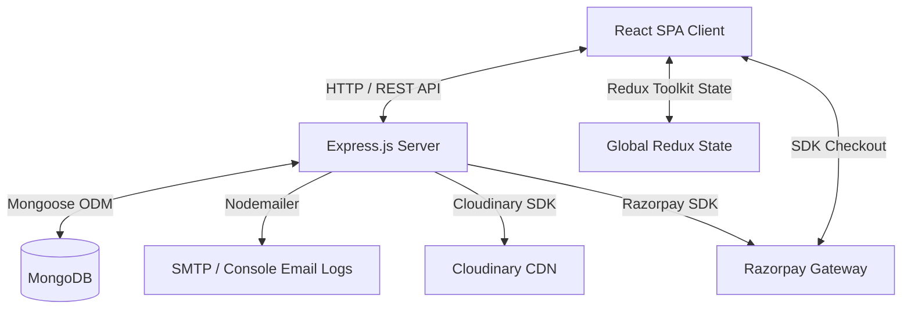
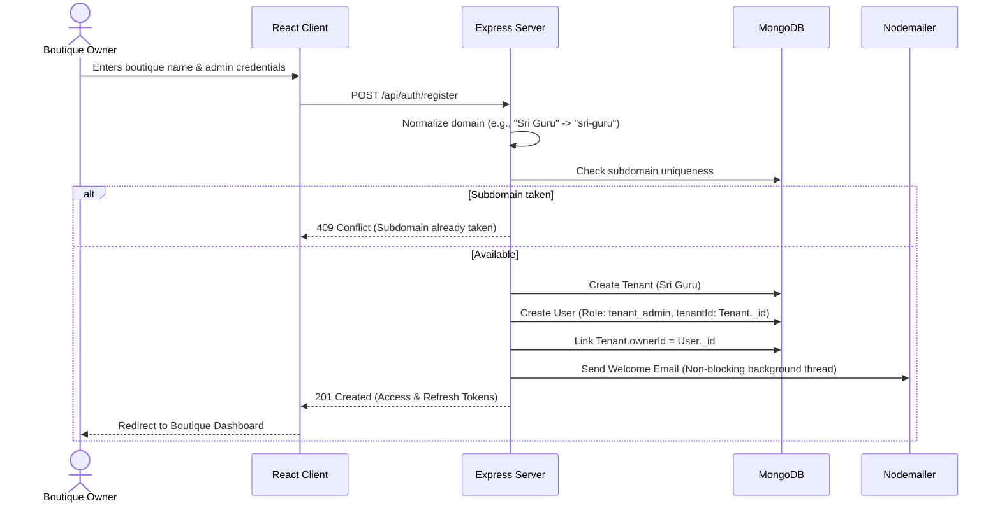
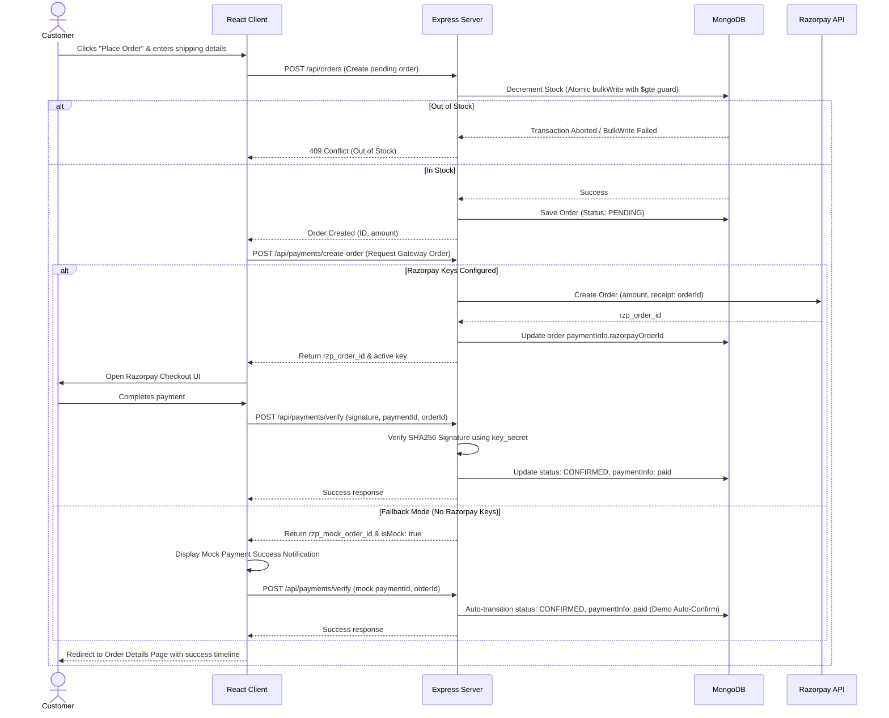
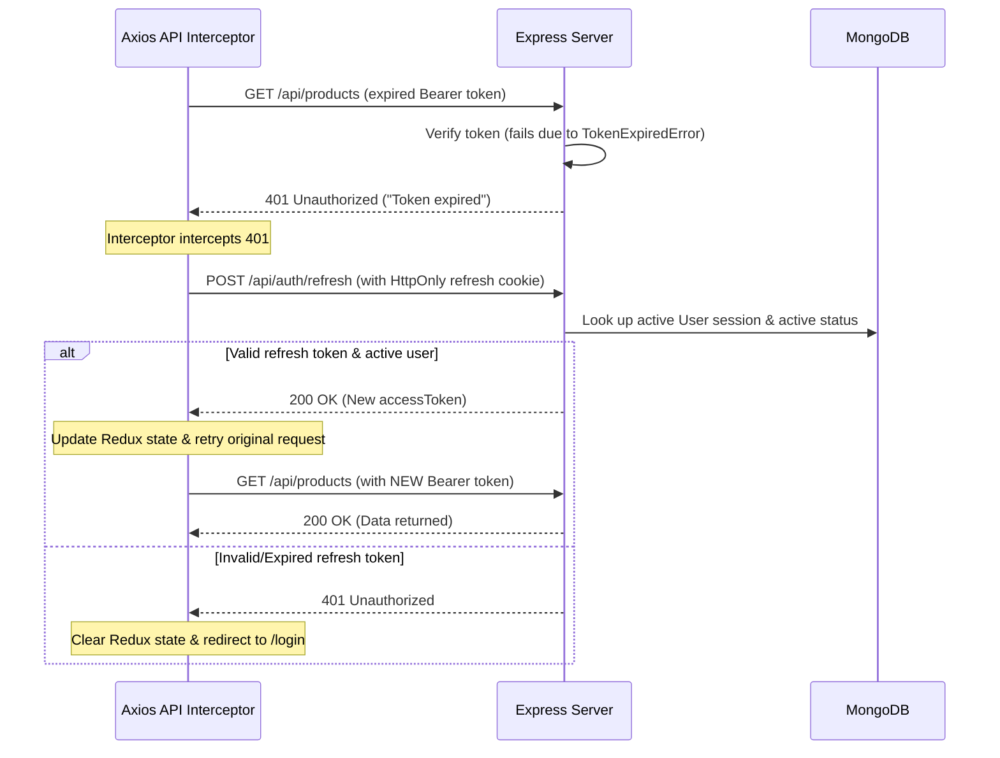

# Saree Tassels — Luxury Fashion SaaS Platform

[](https://nodejs.org/)
[](https://opensource.org/licenses/MIT)
[](https://www.mongodb.com/)
[](https://razorpay.com/)
[](https://cloudinary.com/)

A premium, multi-tenant B2B2C Software-as-a-Service (SaaS) platform built on the **MERN** stack. Saree Tassels enables saree boutiques, traditional weavers, and designer agencies to digitize their catalogs, customize design variants (tassels, zari, weave patterns, length), process online payments securely, and orchestrate the fulfillment of orders.

---

## 🎨 System Architecture

The platform follows a classic decoupled client-server architecture. The frontend is a React Single Page Application (SPA), while the backend is an Express.js REST API backed by MongoDB.



### Key Technical Integrations
*   **Database Isolation:** Shared-database, isolated-schema multi-tenancy enforced at the database layer.
*   **Media Pipeline:** Automated Cloudinary upload with transformer parameters (aspect ratio containment, quality compression, smart-cropping) and a robust in-memory mock fallback.
*   **Payment Infrastructure:** Razorpay integration with HMAC-SHA256 signature verification for payments and webhooks, featuring a mock auto-verify fallback for local development.

---

## 🔄 Core Workflows & System Flows

### 1. Tenant Registration & Onboarding

When a new boutique signs up, a tenant record is provisioned, and a default `tenant_admin` account is created and bound to that tenant.



### 2. Checkout & Payment Verification Flow (With Mock Fallback)

Securing checkout flows against double-selling (race conditions) while providing zero-config mock fallbacks when Razorpay credentials are not defined.



### 3. JWT Authentication & Refresh Token Lifecycle

The platform uses short-lived JWT Access Tokens (transmitted in authorization headers) and long-lived Refresh Tokens (stored in HTTP-Only, SameSite cookies).



---

## 📂 Project Directory Structure

```
saree-tassels/
├── client/                      # React SPA Frontend
│   ├── public/                  # Static assets & index.html
│   └── src/
│       ├── components/          # Reusable UI Elements
│       │   └── common/          # Layout, Navbar, Footer
│       ├── hooks/               # Custom React Hooks
│       ├── pages/               # Routing Page Components
│       │   ├── HomePage.jsx     # Luxury landing page
│       │   ├── LoginPage.jsx    # Portal login with credentials autocomplete
│       │   ├── RegisterPage.jsx # Onboarding screen for new boutiques
│       │   ├── ProductListPage.jsx   # Catalog with filter sidebar
│       │   ├── ProductDetailPage.jsx # Custom variations configurator
│       │   ├── CartPage.jsx     # Shopping bag overview
│       │   ├── CheckoutPage.jsx # Shipping & payment integration
│       │   ├── OrdersPage.jsx   # Interactive history & timelines
│       │   └── DashboardPage.jsx# Admin analytics & product controls
│       ├── services/            # API interceptors (api.js)
│       ├── store/               # Redux Toolkit Config
│       │   └── slices/          # Redux slices (auth, cart, products, orders)
│       ├── utils/               # Formatting and UI helpers
│       ├── App.jsx              # Routes declaration & Provider setup
│       ├── index.css            # Custom CSS Variables & Typography
│       └── index.js             # Client bootstrapper
├── server/                      # Express REST API Backend
│   ├── config/                  # DB connection and media engine setup
│   │   ├── db.js                # Auto-configuring DB connection
│   │   └── cloudinary.js        # File upload router with fallback mocks
│   ├── controllers/             # HTTP route handlers
│   ├── middleware/              # Auth, Tenant isolation, role-checking filters
│   ├── models/                  # Mongoose MongoDB schemas
│   ├── routes/                  # Express Router routes
│   ├── services/                # Business logic and DB queries
│   ├── utils/                   # Nodemailer service and helpers
│   ├── seed.js                  # Database seeder script
│   └── server.js                # Server entry point
├── tests/                       # Automated testing directory
│   ├── auth.test.js             # User & tenant registration tests
│   └── orders.test.js           # Order state machine & checkout tests
├── .env.example                 # Environment keys template
├── package.json                 # Node dependencies and build scripts
└── README.md                    # System documentation
```

---

## 🛠️ Getting Started & Installation

### Prerequisites
*   **Node.js** version 20.0.0 or higher.
*   *Optional:* A running instance of MongoDB local server or MongoDB Atlas URI (if not provided, the application will initialize an internal, in-memory MongoDB database automatically).

### Setup Steps

1.  **Clone the Repository:**
    ```bash
    git clone https://github.com/your-username/saree-tassels.git
    cd saree-tassels
    ```

2.  **Install Server & Client Dependencies:**
    ```bash
    npm install
    cd client && npm install && cd ..
    ```

3.  **Configure Environment Variables:**
    Create a `.env` file in the root directory by copying the template:
    ```bash
    cp .env.example .env
    ```
    *(See the [Environment Configuration](#-environment-configuration) section to customize keys).*

4.  **Launch the Application in Development Mode:**
    ```bash
    npm run dev
    ```
    This script runs both the Express backend server (on `http://localhost:5000`) and the React client (on `http://localhost:3000`) concurrently.

---

## ⚙️ Environment Configuration

The application is engineered to run out of the box with zero external configuration (using mocks for database, payment, and file uploads). To plug in your live production gateways, edit your `.env` file:

| Environment Variable | Description | Default Fallback Behavior |
|----------------------|-------------|----------------------------|
| `NODE_ENV` | Environment mode (`development`, `production`, `test`) | `development` |
| `PORT` | Backend server port | `5000` |
| `MONGO_URI` | Connection string for MongoDB | Starts a local `mongodb-memory-server` in-memory database |
| `JWT_ACCESS_SECRET` | Secret key used to sign JWT Access tokens | Uses a default local placeholder key |
| `JWT_REFRESH_SECRET` | Secret key used to sign JWT Refresh tokens | Uses a default local placeholder key |
| `JWT_ACCESS_EXPIRES_IN` | Validity duration of access token (e.g., `15m`, `1h`) | `1h` |
| `JWT_REFRESH_EXPIRES_IN`| Validity duration of refresh token (e.g., `7d`) | `7d` |
| `CLOUDINARY_CLOUD_NAME` | Cloudinary storage identifier account | Fallback to Mock Storage. Picsum/Unsplash mock URLs returned |
| `CLOUDINARY_API_KEY` | Cloudinary credentials access key | Fallback to Mock Storage. Picsum/Unsplash mock URLs returned |
| `CLOUDINARY_API_SECRET` | Cloudinary credentials secret signature key | Fallback to Mock Storage. Picsum/Unsplash mock URLs returned |
| `RAZORPAY_KEY_ID` | Razorpay sandbox API test Key ID | Fallback to Mock Payments. Payment auto-confirms |
| `RAZORPAY_KEY_SECRET` | Razorpay sandbox API test Secret | Fallback to Mock Payments. Payment auto-confirms |
| `EMAIL_HOST` | Host SMTP Server (e.g., `smtp.gmail.com`) | If undefined, emails are written directly to console logs |
| `EMAIL_PORT` | Port of SMTP Server (e.g., `587`) | `587` |
| `EMAIL_USER` | Authenticating SMTP email address | Consoles logging |
| `EMAIL_PASS` | SMTP application-specific password | Consoles logging |
| `CLIENT_URL` | Frontend client origin URL (CORS verification) | `http://localhost:3000` |

---

## 🚀 Interactive Demo Accounts

The database seeder automatically triggers on startup if the database is empty, introducing pre-configured stores and mock accounts:

### 🔑 Authentication Portals (Click to Auto-fill on Login Page)
*   **Boutique Owner (Admin Dashboard):**
    *   **Email:** `demo@kanmaniknot.com`
    *   **Password:** `demo1234`
*   **Customer User (Storefront & Orders):**
    *   **Email:** `customer@demo.com`
    *   **Password:** `demo1234`

---

## 🔌 API Endpoints Reference

All requests must be prefixed with `/api`. Protected routes require a valid `Bearer <access_token>` in the `Authorization` header.

### 🔑 Authentication (`/api/auth`)
*   `POST /register` — onboard a new boutique tenant and create the `tenant_admin`.
    *   *Body:* `{ name, email, password, tenantName }`
*   `POST /login` — authenticate credentials and retrieve tokens.
    *   *Body:* `{ email, password }`
*   `POST /refresh` — verify HTTP-only refresh cookie and issue a new short-lived access token.
*   `POST /logout` — invalidate user session and clear cookies. *(Protected)*
*   `POST /forgot-password` — issue a password reset token.
*   `POST /reset-password` — reset password.

### 🛍️ Products (`/api/products`)
*   `GET /` — retrieve list of products. Supports query filters: `tenantId`, `category`, `minPrice`, `maxPrice`, `search`, and `page`.
*   `GET /:id` — fetch product details.
*   `POST /` — create a new product and variations. *(Protected, Tenant Admin)*
    *   *Body:* `{ name, description, category, basePrice, variants: [...] }`
*   `PUT /:id` — update product fields or variant specifications. *(Protected, Tenant Admin)*
*   `DELETE /:id` — soft-delete (deactivate) a product. *(Protected, Tenant Admin)*
*   `POST /:id/images` — upload image assets (up to 10) to Cloudinary. *(Protected, Tenant Admin)*

### 📦 Orders (`/api/orders`)
*   `POST /` — checkout cart and create a pending order. *(Protected, Customer)*
    *   *Body:* `{ items: [{ productId, variantSku, qty, price }], shippingAddress: {...} }`
*   `GET /` — retrieve orders received by the boutique tenant. *(Protected, Tenant Admin)*
*   `GET /my` — retrieve orders placed by the current customer. *(Protected, Customer)*
*   `GET /:id` — fetch detailed order information and fulfillment timeline. *(Protected)*
*   `PUT /:id/status` — transition order status (e.g., `PROCESSING` ➔ `SHIPPED`). *(Protected, Tenant Admin)*
    *   *Body:* `{ status, note }`
*   `POST /:id/cancel` — cancel an order. *(Protected)*
    *   *Body:* `{ reason }`

### 💳 Payments (`/api/payments`)
*   `POST /create-order` — create a Razorpay transaction record. *(Protected)*
    *   *Body:* `{ orderId, amount }`
*   `POST /verify` — confirm Razorpay payment completion signature. *(Protected)*
    *   *Body:* `{ razorpayOrderId, razorpayPaymentId, signature, orderId }`
*   `POST /webhook` — catch asynchronous transaction notifications directly from Razorpay.

### 📊 Analytics & Tenant Config (`/api/tenant` & `/api/analytics`)
*   `GET /tenant/profile` — fetch public profile and settings of the current tenant.
*   `PUT /tenant/profile` — update boutique branding color codes, currency settings, etc. *(Protected, Tenant Admin)*
*   `GET /analytics/dashboard` — query tenant sales metrics, category breakdowns, and low stock warnings. *(Protected, Tenant Admin)*

### 📋 Detailed Request/Response Payloads

Below are concrete JSON representations for testing core MERN endpoints via tools like Postman or cURL.

#### 1. Tenant & Admin Registration (`POST /api/auth/register`)
*   **Request Headers:** `Content-Type: application/json`
*   **Request Body:**
    ```json
    {
      "name": "Sri Guru Admin",
      "email": "demo@kanmaniknot.com",
      "password": "demo1234password",
      "tenantName": "Sri Guru Kanmani Knots",
      "plan": "pro"
    }
    ```
*   **Response (201 Created):**
    *   *Headers:* `Set-Cookie: refreshToken=...; HttpOnly; SameSite=Strict; Path=/api/auth; Max-Age=604800`
    *   *Body:*
        ```json
        {
          "message": "Registration successful",
          "accessToken": "eyJhbGciOiJIUzI1NiIsInR5cCI6IkpXVCJ9...",
          "user": {
            "_id": "64d0a1b2c3d4e5f678901234",
            "name": "Sri Guru Admin",
            "email": "demo@kanmaniknot.com",
            "role": "tenant_admin",
            "tenantId": "64d0a1b2c3d4e5f678905678"
          },
          "tenant": {
            "_id": "64d0a1b2c3d4e5f678905678",
            "name": "Sri Guru Kanmani Knots",
            "subdomain": "sri-guru-kanmani-knots",
            "plan": "pro",
            "status": "active"
          }
        }
        ```

#### 2. Create Product with Custom Variants (`POST /api/products`)
*   **Request Headers:** `Authorization: Bearer <accessToken>`, `Content-Type: application/json`
*   **Request Body:**
    ```json
    {
      "name": "Valkalam Kanchipuram Silk",
      "description": "Pure mulberry silk with custom zari brocade and traditional borders.",
      "category": "64d0a1b2c3d4e5f678909876",
      "basePrice": 15500,
      "variants": [
        {
          "sku": "KNC-SILK-GLD-01",
          "tasselType": "Royal Kuchu Knot (Gold Zari)",
          "colour": "Crimson Red & Gold",
          "weavePattern": "Traditional Butta",
          "zariWeight": "250g Pure Gold Zari",
          "length": 6.2,
          "price": 15500,
          "stock": 5
        }
      ],
      "tags": ["bridal", "silk", "kanchipuram"]
    }
    ```
*   **Response (201 Created):**
    ```json
    {
      "product": {
        "_id": "64d0a1b2c3d4e5f67890abcd",
        "tenantId": "64d0a1b2c3d4e5f678905678",
        "name": "Valkalam Kanchipuram Silk",
        "description": "Pure mulberry silk with custom zari brocade and traditional borders.",
        "category": "64d0a1b2c3d4e5f678909876",
        "basePrice": 15500,
        "images": [],
        "variants": [
          {
            "sku": "KNC-SILK-GLD-01",
            "tasselType": "Royal Kuchu Knot (Gold Zari)",
            "colour": "Crimson Red & Gold",
            "weavePattern": "Traditional Butta",
            "zariWeight": "250g Pure Gold Zari",
            "length": 6.2,
            "price": 15500,
            "stock": 5
          }
        ],
        "ratings": {
          "avg": 0,
          "count": 0
        },
        "isActive": true,
        "tags": ["bridal", "silk", "kanchipuram"],
        "createdAt": "2026-07-01T03:30:00.000Z",
        "updatedAt": "2026-07-01T03:30:00.000Z"
      }
    }
    ```

#### 3. Place Order (`POST /api/orders`)
*   **Request Headers:** `Authorization: Bearer <accessToken>`, `Content-Type: application/json`
*   **Request Body:**
    ```json
    {
      "items": [
        {
          "productId": "64d0a1b2c3d4e5f67890abcd",
          "variantSku": "KNC-SILK-GLD-01",
          "qty": 2,
          "price": 15500,
          "name": "Valkalam Kanchipuram Silk"
        }
      ],
      "totalAmount": 31000,
      "shippingAddress": {
        "line1": "No. 45 Palace Road",
        "line2": "Vasanth Nagar",
        "city": "Bengaluru",
        "state": "Karnataka",
        "pincode": "560001",
        "phone": "+91 98765 43210"
      }
    }
    ```
*   **Response (201 Created):**
    ```json
    {
      "order": {
        "_id": "64d0a1b2c3d4e5f67890eeee",
        "tenantId": "64d0a1b2c3d4e5f678905678",
        "customerId": "64d0a1b2c3d4e5f678903333",
        "items": [
          {
            "productId": "64d0a1b2c3d4e5f67890abcd",
            "variantSku": "KNC-SILK-GLD-01",
            "qty": 2,
            "price": 15500,
            "name": "Valkalam Kanchipuram Silk"
          }
        ],
        "totalAmount": 31000,
        "status": "PENDING",
        "paymentInfo": {
          "status": "pending"
        },
        "shippingAddress": {
          "line1": "No. 45 Palace Road",
          "line2": "Vasanth Nagar",
          "city": "Bengaluru",
          "state": "Karnataka",
          "pincode": "560001",
          "phone": "+91 98765 43210"
        },
        "timeline": [
          {
            "status": "PENDING",
            "note": "Order initialized",
            "timestamp": "2026-07-01T03:35:00.000Z"
          }
        ],
        "createdAt": "2026-07-01T03:35:00.000Z",
        "updatedAt": "2026-07-01T03:35:00.000Z"
      }
    }
    ```

#### 4. Confirm Payment (`POST /api/payments/verify`)
*   **Request Headers:** `Authorization: Bearer <accessToken>`, `Content-Type: application/json`
*   **Request Body:**
    ```json
    {
      "razorpayOrderId": "rzp_mock_64d0a1b2c3d4e5f67890eeee",
      "razorpayPaymentId": "pay_mock_64d0a1b2c3d4e5f67890eeee",
      "signature": "mock_signature_signature_hash...",
      "orderId": "64d0a1b2c3d4e5f67890eeee"
    }
    ```
*   **Response (200 OK):**
    ```json
    {
      "success": true,
      "order": {
        "_id": "64d0a1b2c3d4e5f67890eeee",
        "status": "CONFIRMED",
        "paymentInfo": {
          "razorpayOrderId": "rzp_mock_64d0a1b2c3d4e5f67890eeee",
          "razorpayPaymentId": "pay_mock_64d0a1b2c3d4e5f67890eeee",
          "status": "paid",
          "paidAt": "2026-07-01T03:36:00.000Z"
        }
      }
    }
    ```

---

## 🏗️ Architectural & Engineering Patterns

### 🛡️ Multi-Tenant Data Isolation
To prevent cross-tenant information leaks, all Mongoose models partition data at the database level using a mandatory `tenantId` field:
*   A custom Mongoose `find` pre-hook logs a system warning if any database query is executed without filtering by `tenantId`.
*   Routes requiring authentication resolve and inject `req.user.tenantId` into parameters automatically.

### 🔄 Order State Machine Guards
Order tracking relies on a strict directed acyclic state transition machine. Arbitrary transitions (e.g., jump-updating a cancelled order to delivered) are blocked.

```
       [PENDING] ────► [CANCELLED]
           │
           ▼
      [CONFIRMED] ───► [CANCELLED]
           │
           ▼
     [PROCESSING]
           │
           ▼
       [SHIPPED]
           │
           ▼
      [DELIVERED] ───► [RETURNED]
```

This sequence is verified through a Mongoose document method:
```javascript
const ALLOWED_TRANSITIONS = {
  PENDING:    ['CONFIRMED', 'CANCELLED'],
  CONFIRMED:  ['PROCESSING', 'CANCELLED'],
  PROCESSING: ['SHIPPED'],
  SHIPPED:    ['DELIVERED'],
  DELIVERED:  ['RETURNED'],
  CANCELLED:  [],
  RETURNED:   [],
};
orderSchema.methods.canTransitionTo = function (newStatus) {
  return ALLOWED_TRANSITIONS[this.status]?.includes(newStatus) ?? false;
};
```

### ⚡ Atomic Inventory Reductions
To guarantee zero-overselling (preventing race conditions during flash bridal drops), item quantities are decremented atomically using MongoDB `$inc` with a query filter condition (`'variants.stock': { $gte: qty }`) wrapped in a Mongoose `bulkWrite` transaction:

```javascript
const ops = items.map(({ productId, variantSku, qty }) => ({
  updateOne: {
    filter: { _id: productId, tenantId, 'variants.sku': variantSku, 'variants.stock': { $gte: qty } },
    update: { $inc: { 'variants.$.stock': -qty } },
  },
}));
const result = await Product.bulkWrite(ops);
if (result.modifiedCount !== items.length) {
  throw new Error('One or more items are out of stock');
}
```

### 🧱 Resilient Fallback Architecture
The system is built to survive missing external credentials gracefully. Developers can prototype, demo, or run tests with zero configuration:
1.  **Database Fallback:** If `MONGO_URI` is blank, `db.js` automatically spawns an in-memory instance of `mongodb-memory-server`.
2.  **Upload Fallback:** If Cloudinary keys are omitted, `cloudinary.js` intercepts uploads using `multer.memoryStorage()`, generating mock Unsplash/Picsum image paths dynamically.
3.  **Payment Fallback:** If Razorpay keys are omitted, `paymentController.js` creates a mock payment object, bypassing signature validation and transitioning orders immediately upon submission.

---

## 🧪 Automated Testing

Integration tests use Jest and Supertest. The database connection is handled cleanly via Jest lifecycle hooks:

```bash
# Run the complete integration test suite
npm test

# Run tests and capture coverage metrics
npm run test:coverage
```

---

## 📝 License

Distributed under the MIT License. See [LICENSE](LICENSE) for more details.
